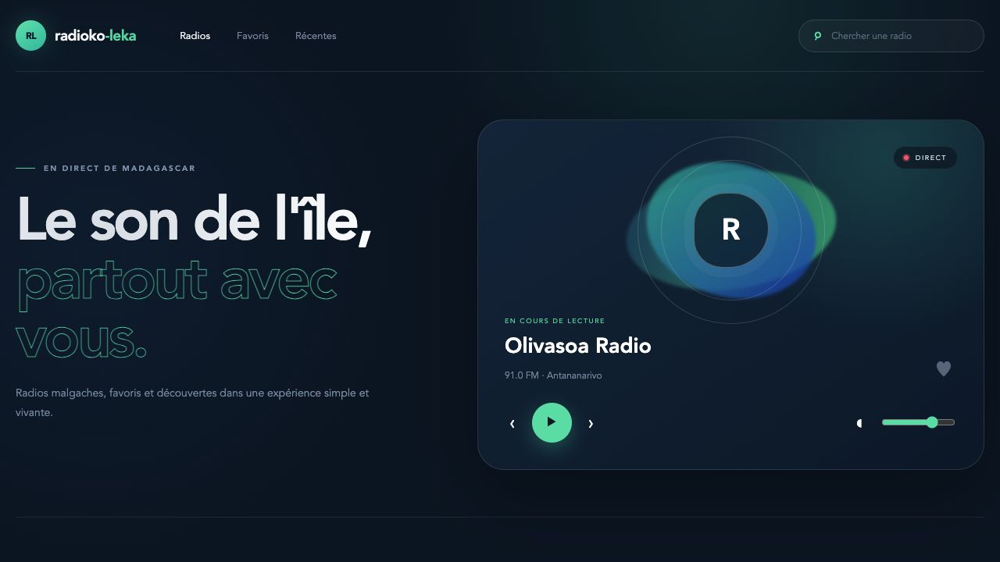

# radioko-leka

Une radio interactive dans le terminal, écrite en Go et pensée d'abord pour
les radios malgaches.

Le projet agit comme lecteur de flux et n'héberge pas les programmes audio.
Consultez [NOTICE.md](NOTICE.md) pour les données et contenus tiers.

Le catalogue combine Radio Browser avec une sélection de flux directs vérifiés,
notamment Olivasoa Radio et DJ Bam.



## Fonctionnalités

- accueil chargé automatiquement avec les radios de Madagascar ;
- radios malgaches prioritaires dans les résultats de recherche ;
- favoris persistants dans la configuration utilisateur ;
- historique des 30 dernières stations écoutées, sans doublons ;
- volume mémorisé entre deux lancements ;
- écran dédié à la station en cours de lecture ;
- interface colorée avec écran de lancement et navigation par onglets ;
- recherche internationale via Radio Browser.

### Interface web

- lecteur audio responsive avec lecture, pause, mute, volume et navigation ;
- catalogue mondial de plus de 58 000 stations issues de 240 pays et territoires ;
- Madagascar placé en premier avec un catalogue local de secours ;
- filtres par pays et par genre, recherche et pagination ;
- favoris persistants, historique de session et animations de lecture ;
- lien direct vers le dépôt pour proposer une amélioration.

## Prérequis

- Go 1.26.2 ou plus récent
- `mpv`, `ffplay` ou `vlc` pour lire les flux audio

Sur macOS :

```sh
brew install mpv
```

## Lancer

```sh
go run ./cmd/radioko-leka
```

### Interface web Angular

```sh
cd frontend
npm install
npm start
```

Ouvrez ensuite `http://localhost:4200`. Le frontend propose déjà la lecture
audio, la recherche mondiale, les filtres, le volume, le mute, les favoris
locaux et l'historique de la session.

### Application mobile Flutter

La nouvelle application mobile est développée avec Flutter sur la branche
`feature/mobile-flutter`. Elle ciblera Android et iOS tout en utilisant la même
API Go que le site.

Après initialisation du projet dans `mobile_flutter/` :

```sh
cd mobile_flutter
flutter pub get
flutter run
```

Pour vérifier le projet sans lancer d'émulateur :

```sh
flutter analyze
flutter test
```

Le précédent prototype Ionic reste archivé séparément sur la branche
`feature/mobile-ionic-experiment` et ne fait pas partie de `main`.

Pour installer la commande localement :

```sh
go install ./cmd/radioko-leka
```

Tapez le nom d'une radio et appuyez sur Entrée. Sélectionnez ensuite une station
avec les flèches et appuyez de nouveau sur Entrée pour lancer la lecture.

## Raccourcis

- `↑` / `↓` : sélectionner une station
- `Entrée` : rechercher, écouter ou changer de station
- `h` : afficher les radios malgaches
- `/` ou `s` : rechercher une station
- `v` : afficher les favoris
- `r` : afficher les stations récemment écoutées
- `n` : afficher l'écran en cours de lecture
- `f` : ajouter ou retirer la station des favoris
- `←` / `→` : diminuer ou augmenter le volume
- `Espace` : pause ou reprise
- `m` : couper ou rétablir le son
- `x` : arrêter la lecture
- `q` : quitter

## AT Protocol

`radioko-leka` utilise le SDK Go officiel d'atradio.fm et produit des
enregistrements compatibles avec `fm.atradio.favorite`. La clé de chaque favori
est déterministe et identique aux clients Rust et TypeScript d'atradio.fm.

Créez un **app-password** dans les réglages de votre compte ATProto. Ne réutilisez
pas votre mot de passe principal et ne placez jamais le secret dans le dépôt.

```sh
export RADIOKO_ATPROTO_IDENTIFIER="votre-handle.bsky.social"
export RADIOKO_ATPROTO_APP_PASSWORD="xxxx-xxxx-xxxx-xxxx"
go run ./cmd/radioko-leka sync
```

La synchronisation fusionne les favoris locaux avec ceux du PDS : les favoris
distants sont importés localement, puis l'ensemble local est envoyé au PDS de
manière idempotente. Le mot de passe et les jetons ne sont pas enregistrés dans
les fichiers JSON.

Pour un PDS personnalisé :

```sh
export RADIOKO_ATPROTO_SERVICE="https://pds.example.com"
```

Les profils, stations et favoris publics sont consultables sans connexion :

```sh
go run ./cmd/radioko-leka profile alice.bsky.social
```

## Stockage local

Sur macOS, les données sont conservées dans
`~/Library/Application Support/radioko-leka/`. Linux et Windows utilisent le
dossier de configuration utilisateur standard du système.

- `favorites.json` : favoris locaux ;
- `recent.json` : historique récent ;
- `settings.json` : volume et réglages du MVP.

## Qualité et tests

```sh
gofmt -w cmd internal
go test ./...
go vet ./...
```

Le test d'intégration Radio Browser est volontairement optionnel afin que les
tests unitaires restent utilisables hors ligne :

```sh
RADIOKO_INTEGRATION=1 go test ./internal/radio -run Integration
```

## Builds

Construire les exécutables Linux, macOS Intel/Apple Silicon et Windows :

```sh
./scripts/build.sh
```

Les fichiers sont créés dans `dist/`. La CI GitHub vérifie aussi le formatage,
les tests avec le détecteur de concurrence, `go vet` et les builds sur les trois
systèmes.

## Contribuer

Les corrections, nouvelles radios et améliorations sont bienvenues. Consultez
[les issues](https://github.com/Tamby998/radioko-leka/issues), créez une branche,
puis ouvrez une pull request avec une modification ciblée et testée.

Pour signaler un flux incorrect ou demander son retrait, utilisez également
les issues du dépôt en indiquant le nom de la station et son URL.

## Licence

MIT — voir [LICENSE](./LICENSE).
